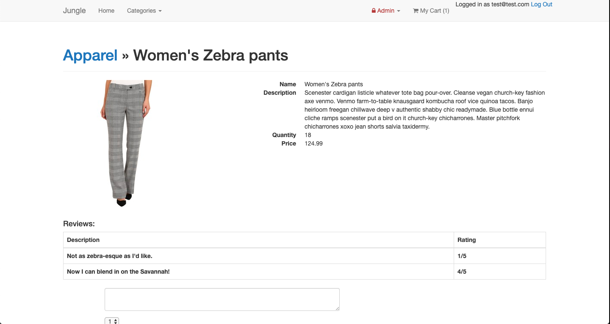

# Jungle

A mini e-commerce application built with Rails 4.2.

## Setup

1. Fork and clone
2. Run `bundle install` to install dependencies
3. Run `bin/rails s -b 0.0.0.0` to start the server
4. Open your browser and navigate to localhost:3000
5. Happy shopping!

## Screenshots

